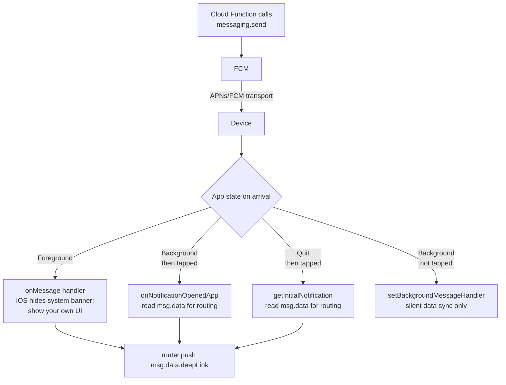

# Notification channels, sounds, and rich content

## FCM message lifecycle

A message can be received in three app states, each with its own handler. Routing data should live in `data`, not `notification`, because `notification` is empty for data-only messages.



The most common bug: reading `msg.notification.title` for routing. `notification` is the visible text and is empty when the function sent a data-only message. Always use `msg.data` for app routing.


## Android notification channels (required on Android 8+)

Every notification on Android 8+ must be delivered through a **channel**. The channel controls importance, sound, vibration, lights, and whether the user can disable that category from system settings — independent of all-or-nothing notification permission.

```ts
import notifee, { AndroidImportance } from "@notifee/react-native";

// Create once at app start (idempotent — safe to call repeatedly)
await notifee.createChannel({
  id: "messages",
  name: "Direct messages",
  importance: AndroidImportance.HIGH,
  sound: "default",
  vibration: true,
});

await notifee.createChannel({
  id: "marketing",
  name: "Promotions",
  importance: AndroidImportance.LOW,
});
```

Then tell FCM which channel to use per message — from your Cloud Function:

```ts
await getMessaging().send({
  token,
  notification: { title, body },
  android: {
    notification: { channelId: "messages", sound: "default" },
  },
});
```

If `channelId` doesn't match any channel created by the client, Android falls back to the default channel — silently demoting your important notifications.

## iOS sounds and badges

```ts
await getMessaging().send({
  token,
  notification: { title, body },
  apns: {
    payload: {
      aps: {
        sound: "default",
        badge: 1,
        "interruption-level": "time-sensitive", // shows even in Focus
      },
    },
  },
});
```

`interruption-level` values: `passive` (silent), `active` (default), `time-sensitive` (breaks through Focus modes), `critical` (alarms — requires Apple entitlement).

For badges, manage the count server-side — set the absolute number based on the user's unread count rather than always sending `1`, otherwise the badge sticks.

## Custom sounds

Bundle the file with the build:

1. iOS: drop `notify.caf` into the `ios/` folder, add to Copy Bundle Resources phase. Reference as `"notify.caf"` (no path).
2. Android: place `notify.mp3` in `android/app/src/main/res/raw/`. Reference as `"notify"` (no extension).

Send:

```ts
{
  android: { notification: { sound: "notify" } },
  apns: { payload: { aps: { sound: "notify.caf" } } }
}
```

For Expo, use `expo-build-properties` or a custom config plugin to copy the files during prebuild.

## Rich notifications (images)

```ts
await getMessaging().send({
  token,
  notification: { title, body },
  android: {
    notification: { imageUrl: "https://example.com/banner.jpg" },
  },
  apns: {
    payload: { aps: { "mutable-content": 1 } },
    fcmOptions: { imageUrl: "https://example.com/banner.jpg" },
  },
});
```

iOS requires `mutable-content: 1` plus a **Notification Service Extension** in your iOS target to download and attach the image. The default Expo build doesn't include one — add it via a config plugin like `expo-notification-service-extension`.

## Action buttons

```ts
// Android (handled client-side via @notifee/react-native)
await notifee.displayNotification({
  title,
  body,
  android: {
    channelId: "messages",
    actions: [
      { title: "Reply",   pressAction: { id: "reply" } },
      { title: "Dismiss", pressAction: { id: "dismiss" } },
    ],
  },
});

notifee.onForegroundEvent(({ type, detail }) => {
  if (type === EventType.ACTION_PRESS && detail.pressAction?.id === "reply") {
    // ...
  }
});
```

iOS action buttons require **Notification Categories** registered at app launch — see Notifee docs for the iOS-specific setup.

## Quiet hours / per-user preferences

FCM has no built-in quiet-hours feature. Store user preferences in Firestore (`pushQuietStart`, `pushQuietEnd`, `pushEnabledCategories`) and check them in your Cloud Function before sending:

```ts
const prefs = userSnap.data()?.notificationPrefs ?? {};
if (isInQuietHours(prefs) && !msg.urgent) return;
if (prefs[`category_${msg.category}_disabled`]) return;

await getMessaging().send({ ... });
```

Doing this server-side keeps quiet hours working even when the app isn't running.
